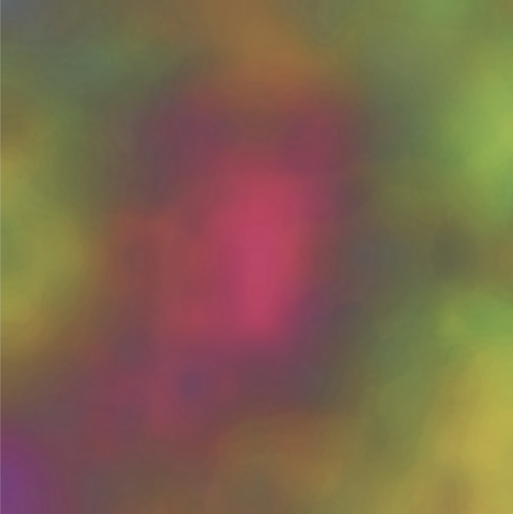

# Generative Gestaltung
In diesem Repository befinden sich meine Ergebnisse der Übungsaufgaben für das Modul Generative Gestaltung aus dem WS2021/22 an der Beuth Hochschule für Technik.

## U1 - Aufwärmung

